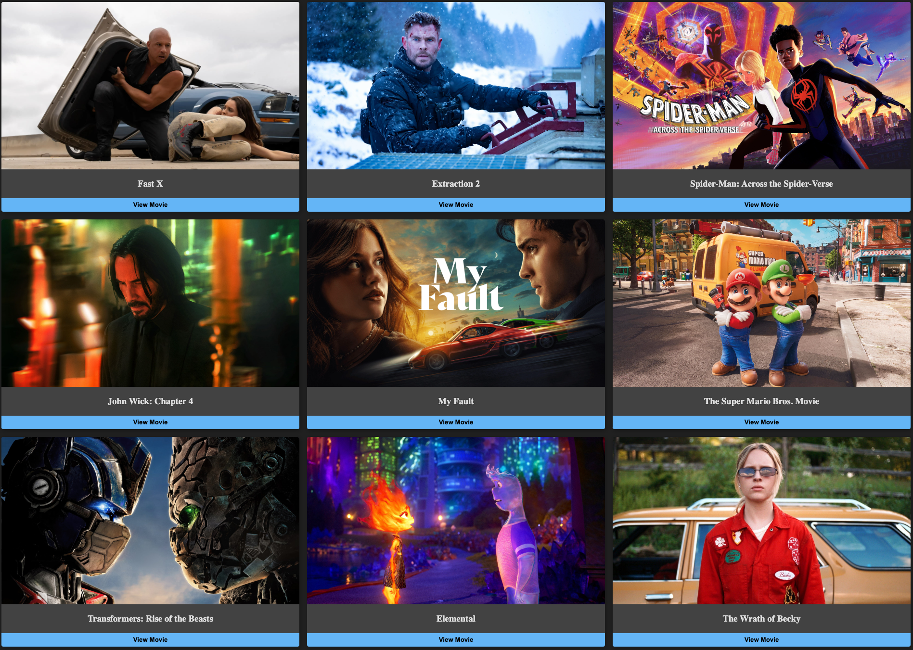

### Date: 6/29/2023

#### By: Michael Lackey

#### [Website](https://michaellackey.com/) | [GitHub](https://github.com/NobodysLackey) | [LinkedIn](https://www.linkedin.com/in/michaelglackey/)
***

### ***Description***

##### An example for students on how to interact with an API in React.

##### The app was deployed and can be viewed [here](https://react-apis.surge.sh/).

***

### ***Technologies Used***

***

### ***Getting Started***

##### When the page loads, results from an API call are displayed - the top 20 movies in the US. When you click on view movie, and component conditionally renders with more details about the movie as a secondary API call is made.

***

### ***Screenshots***

  <pre>
    &nbsp;&nbsp;&nbsp;
  </pre>

***

### ***Future Updates***

- [ ] Make the app scale for multiple sized screens
- [ ] Add nav bar
- [ ] More fleshed out details page

***

### ***Credits***

- [RAWG](https://rawg.io/)

***
